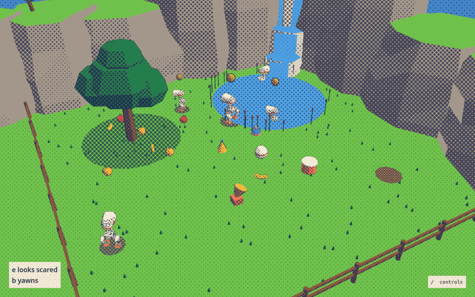
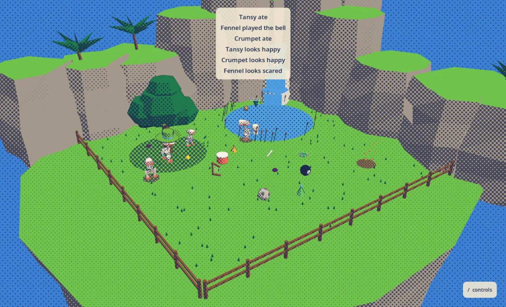
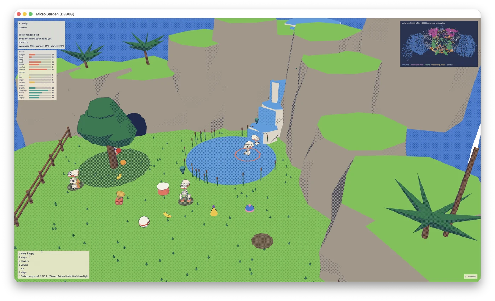
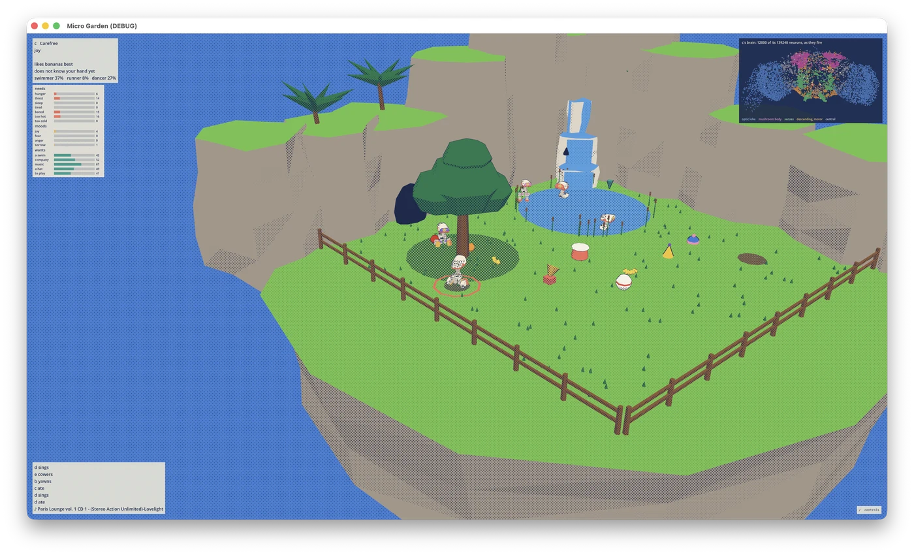

# Micro Garden



Micro Garden is five small ducks in a garden, and each duck runs on its own live copy of a real fruit fly brain. I built it to ask whether a wiring diagram, a body with needs, and a place to live are enough to get behaviour nobody scripted. The brain is the FlyWire connectome, about 139,000 neurons and 2.7 million connections, simulated as spiking neurons. Each duck smells, sees, hears, gets hungry, thirsty, hot and sleepy, learns, makes friends and grudges, and has a personality.

The ducks are modelled on the [microduck](https://github.com/pollen-robotics/microduck), a real open-source robot, and the brain talks to the body through that robot's own command protocol. There are two bodies. One is a 2D body in Python. The other is the microduck's own MuJoCo simulation, where the real robot daemon runs the real walking policy and five simulated ducks live a garden day on five fly brains. A low-poly garden in Godot draws either body. The project is simulation only, and I do not plan real ducks on a floor.

## Run it

You need macOS on Apple Silicon or any machine PyTorch supports, Python 3.12, [uv](https://docs.astral.sh/uv/), and [Godot 4](https://godotengine.org) in `/Applications`, on your path as `godot`, or wherever `GODOT` points. The repo does not redistribute the FlyWire data, so download two files into `data/`:

- `proofread_connections_783.feather` from the [FlyWire v783 release on Zenodo](https://doi.org/10.5281/zenodo.10676866)
- `Supplemental_file1_neuron_annotations.tsv` from [flyconnectome/flywire_annotations](https://github.com/flyconnectome/flywire_annotations)

Then open the garden with one command:

```
uv run python -m garden
```

That starts five ducks on five brains and opens the Godot window over them. Closing the window ends the garden and saves it. The next time you open it, the ducks have aged by however long you were away. Add `--fresh` to hatch new ducks, `--labels Bully,Napper,Carefree,Chatty,Scaredy` to choose who hatches, and `--blind` to hide who is who until you quit. Five ducks with their eyes open run at about real time on an M-series Mac.

## The garden

The garden is laid out after the Chao gardens of Sonic Adventure 2. A lawn sits in a bowl of rock, with a pond under a waterfall, a fruit tree, and a rail fence over the sea. The ducks are the real microduck, built from Pollen Robotics' own meshes and posed joint by joint. They sit, walk, kick and get up with the robot's own recorded motions. A halftone screen of ink shades everything, and night is a wash of blue. A flag on the near cliff shows the breeze, which is how the ducks find food.



Select a duck and you see who it is, what it needs and feels, and its fly brain firing:





Godot only draws. The garden publishes its world over UDP, and what you do goes back as the same control calls the 2D window uses. Press `/` to see every control:

- Click a duck to select it. The camera follows it, one panel shows its needs, moods and wants as bars, and another shows its fly brain: 12,000 of its 139,000 neurons where FlyWire has them, each flaring as it fires.
- `Tab` rides the selected duck. W, A, S and D steer it, and you see its two hex retinas and what its descending neurons ask of its legs. `O` hides that overlay.
- `H` brings out a hand in place of the cursor. Hold the left button to pick up fruit, a hat, a ball, the drum, the music box or a duck, and let go to put it down. Let go on the move and you throw it. With the hand out the camera turns on a right-drag, and otherwise on a plain drag.
- `F` shakes fruit down from the tree, and so does a tap on it. The tree stops dropping fruit by itself once four lie on the lawn, and your shakes keep working up to twelve.
- `G` hands the selected duck a fruit, `P` pets it, and `C` claps.
- `T` drops a hat at the mouse and `B` drops a ball. `D` puts a small drum down or takes it up, and `M` does the same for the music box.

The music box plays your own music. Put mp3s in `~/.cache/micro-garden/music/` and it shuffles them while the box is in the garden. Click the box to step its volume, and off means off for the ducks too. No music ships with the project.

## What the ducks do

A duck eats when it is hungry, drinks when it is thirsty, and sleeps when it is tired. A hungry duck follows the smell of fruit up the wind, and a thirsty one follows damp air to the pond. A duck that gets too hot goes to cool off, and its love of water decides where: a water lover heads for the pond and a water-shy duck for the shade of the tree. With nothing pressing, a duck sits or stands about until boredom sets it wandering.

The ducks have each other. A shove makes a grudge and time together makes a friend, duck by duck, and each duck can smell the others from across the garden. Friends keep each other company at arm's length. They stop closing in once they are side by side, and a crowded duck steps aside. A kind duck goes to one that is crying, and an alarm spreads from duck to duck. A song pleases a sociable duck and annoys a solitary one.

They also come to know your hand. Pet a duck or hand it a fruit and it learns to come to you. A duck that trusts your hand likes being carried, and a thrown duck trusts you less. Each duck has a fruit it likes best.

A playful duck chases the ball and taps the drum. A duck that likes music dances while the box plays, and a bored one sings or dances anyway. The ducks nearby are its audience. A duck that finds a hat decides whether to wear it, and a vain duck usually does. A duck that shakes one off leaves it on the lawn for the next.

Every so often a duck acts out its strongest feeling with its head and its voice, as a Chao or a Sim does. A chatty duck does it more often. Strong characters have a trick of their own. An aggressive duck stomps, a sleepy one yawns, a water lover splashes, a chatty one sings, and a timid one cowers.

## What the brain does and what is explicit

I try to be exact here, because "fly brain drives a duck" is an easy claim to inflate.

The senses go in through the fly's real sensory neurons: food and danger smells, humidity, heat and cold, touch, taste, sound and wind on the antennae, and light through a model of the optic lobe ([flyvis](https://github.com/TuragaLab/flyvis)). Movement comes out through real descending neurons. A screen of the whole brain found them, and I did not pick their names from papers. The clearest one is DNge091. It fires on the side the wind comes from, it does the same on a held-out seed, and it stays silent when the wiring is shuffled. A duck that smells food turns into the wind and walks up the plume, which is how a real fly finds food. With the real wiring a duck finds a dish in 20 of 20 trials. With the wiring shuffled it finds it in 1 of 20.

Learning is the fly's too. The only synapses that change are the ones between Kenyon cells and mushroom body output neurons. Dopamine gates them, with reward through one set of neurons and punishment through another.

Some behaviour is explicit code and not the brain, and the code says so where it happens. The body decides how much attention each sense gets, so a hungry duck listens to the wind and a fed one does not. The brain's own left and right signals for a smell sit below its steering noise. So explicit readouts turn a duck toward music, a ball, other ducks, a hand it trusts, and the pond or the shade when it is hot. Everything between the ducks is explicit too. Friendships, grudges, comfort, trust and skills are slow quantities that events push about, and they steer a duck the same way. Personalities are presets over continuous dials, in the style of the Chao.

## Other ways to run it

The 2D window is the plainest view of the garden:

```
uv run python -m body.stub2d.stub --view --brain
```

Click a duck to follow it and click the tree to shake fruit down. `P` pets the selected duck, `C` claps, `F` drops food at the mouse, `M` picks the music up or puts it down, and `H` puts a hat on a duck or takes it off. `Tab` takes the wheel of the selected duck, and W, A, S and D drive it while its brain keeps watching.

To run the ducks as simulated robots, check out [microduck](https://github.com/pollen-robotics/microduck) and [microduck_rl](https://github.com/pollen-robotics/microduck_rl), start five ducks with `DUCK_SIM_DUCKS=5 scripts/duck-sim`, and then start the garden around them:

```
uv run python -m body.mujoco.adapter --ducks 5 --brain --godot
```

The simulator runs natively on a Mac. The walking policy upstream ships does not yet track a velocity ([microduck_rl issue 46](https://github.com/pollen-robotics/microduck_rl/issues/46)), so these ducks march and pivot. Either body takes `--godot` to open the Godot garden. Add `--no-window` to publish the world only and open `viewer/godot` yourself.

## How it is checked

I build in gates. One gate is one runnable check that exits non-zero when it fails.

```
uv run python -m gates # all of them, which takes hours
uv run python -m gates --fast # the ones that take about a minute
uv run python -m gates 4 8 # just those
```

The fast gates pass. The last full run passed 14 of 15. The one failure was Gate 5's check that a fed duck that is too hot goes to cool off. Heat now sends a duck to the pond or the shade, and Gate 5 has not run since. Two other results stand because they are true. The five demo personalities are hard to tell apart by numbers alone, so Gate 5 prints that comparison and does not assert it. The Bully's aggression costs it food, and I count that as character, not a bug.

## Where things are

- `garden.py` is the one command that opens the garden.
- `brain/` loads the connectome and holds the spiking model, the sensory encoder, the motor decoder, learning, bodily needs, the ducks' life together, emotes, and the personality presets.
- `body/` holds the robot command contract, the sensory frame, the 2D body with its retina, and the adapter for the MuJoCo robots.
- `world/` holds the garden: smells that drift on the wind, the pond, rocks, temperature, day and night, fruit, balls and music.
- `viewer/` holds the debug window, the world snapshot, and the Godot garden with the scripts that build its robot and record its motions.
- `gates/` holds one check per gate.

## Credit

The connectome is the work of the FlyWire Consortium. The repo does not redistribute its data: you download it into `data/`, which git ignores. The connectivity (`proofread_connections_783.feather`, [Zenodo 10.5281/zenodo.10676866](https://doi.org/10.5281/zenodo.10676866)) is CC BY 4.0. The annotations come from [flyconnectome/flywire_annotations](https://github.com/flyconnectome/flywire_annotations), which has no licence file and asks users to cite its papers. Please cite:

- Dorkenwald et al. (2024), "Neuronal wiring diagram of an adult brain", *Nature*.
- Schlegel et al. (2024), "Whole-brain annotation and multi-connectome cell typing of *Drosophila*", *Nature*.
- Matsliah et al. (2024), "Neuronal parts list and wiring diagram for a visual system", *Nature*.
- Berg et al. (2025), male CNS connectome and annotation updates.

This project also leans on these:

- [pollen-robotics/microduck](https://github.com/pollen-robotics/microduck) (Apache-2.0). The body contract follows robotd's JSON-RPC method and parameter names, and no code is copied.
- [pollen-robotics/microduck_rl](https://github.com/pollen-robotics/microduck_rl) (Apache-2.0). `viewer/godot/robot.json` is a derived work of the microduck's own meshes, posed from its MuJoCo description and simplified to about 10,000 triangles by `viewer/godot/build_robot.py`, and `viewer/godot/clips.json` records its policies' motions. Its licence is in `viewer/godot/LICENSE-microduck`.
- [TuragaLab/flyvis](https://github.com/TuragaLab/flyvis) (MIT) is the visual front end, installed as a dependency.
- [snedea/flybrain](https://github.com/snedea/flybrain) (MIT) supplied starting LIF parameters and the neuron group map as a reference, and no code is copied.
- [philshiu/Drosophila_brain_model](https://github.com/philshiu/Drosophila_brain_model) (MIT, Shiu et al. 2024) gave the idea of treating glutamate as inhibitory and of reading sugar responses from proboscis motor neurons, and no code is copied.

The model also leans on Gaudry et al. (2013) on asymmetric ORN transmitter release, and on Schretter et al. (2020) and Deutsch et al. (2020) on the aIPg and pC1d/e aggression circuits. Where the model departs from them, the code says so.

I direct the project and make its decisions. Claude Code wrote most of the code, as the commit history shows. The code is MIT licensed, and the FlyWire data has its own terms, listed above.
